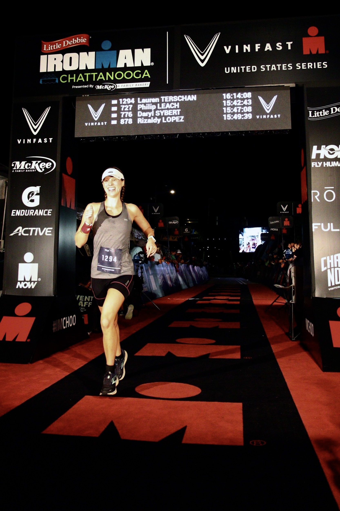

<!-- 
 -->
<!--	<h2 class="pageTitle">About Lauren</h2> -->
<!--	   -->
<!--	  -->

 

<blockquote style="text-align:center;">My name is Lauren Terschan and I am passionate about finding innovative solutions through analysis, visualization, and design.</blockquote>

## Professional
I thrive in an environment that allows me to leverage the three key areas of my experience: economic thinking, data analysis (collection to visualization), and strategic mindset. This unique trio of skills connects critical business questions to solutions: given the need to understand and adapt to the changing economy and market around us, how do we simultaneously and strategically position ourselves to create the greatest impact and optimize the path to get there? How do we leverage data and its insights to provide an objective view of the landscape and help us navigate forward? This is what I love to do.

I hold a Bachelor’s and Master’s of Science in Economics from the Georgia Institute of Technology as well as a certificate in Data Analytics.

## Personal
I am a competitive triathlete and a former personal trainer. I have always loved being active and learning about health and wellness. I have completed every triathlon distance, including a full-distance Ironman. 

I'm also interested in personal finance, nutrition, and exploring. I love being outside in nature and will take every opportunity I get to be outside and active!

<!-- 
 -->

<!-- style="width:50%" -->
